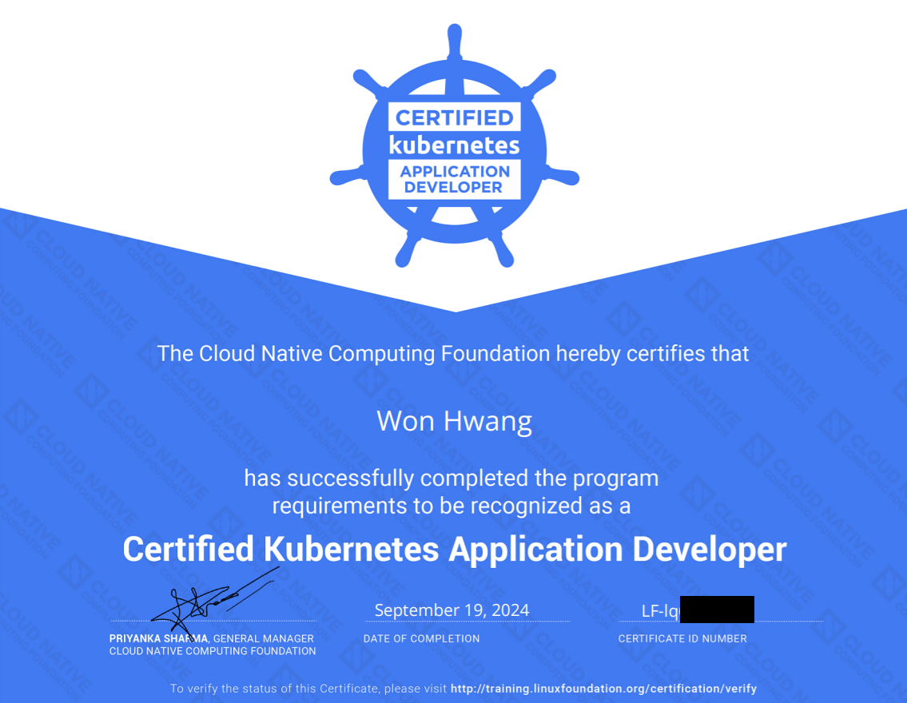
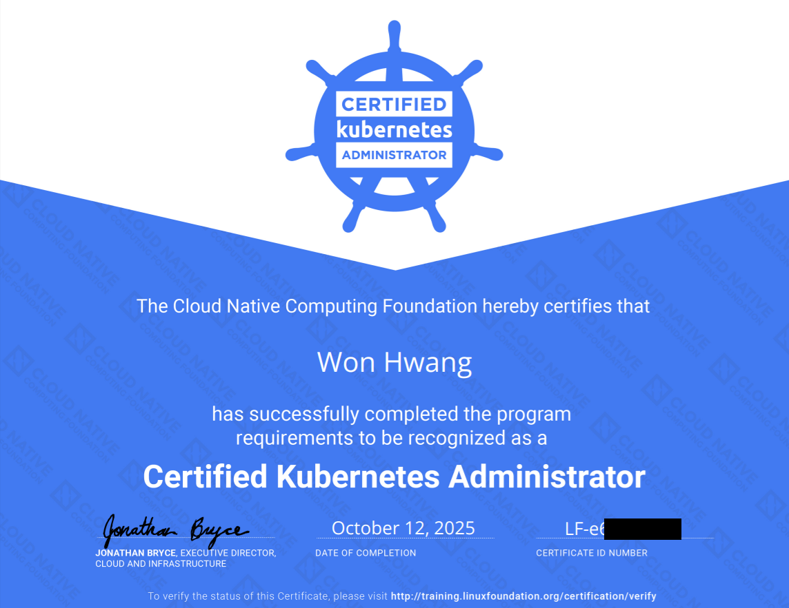

## 📜 Technical Stack

  

   

 

  

  

## 📝 Career

|Designation|Position|Start date|End date|
|------|---|---|---|
|인하대학교|정보통신공학과|2016.03|2022.08|
|데이터 인텔리전스 연구실 (Inha)|학부연구생|2018.11|2019.06|
|(주) Mindslab|병역특례 - IT 산업기능요원 (Developer)|2019.12|2021.08|
|LINE+|LINE Platform Engineering SQE Team (DevOps)|2022.07|~|

## 📝 Certificate

|Name|Organization|Date of Completion|Expiration|Image|
|------|---|---|---|---|
|CKAD (Certified Kubernetes Application Developer)|Linux Foundation|2024.09.19|2026.09.18|

Image

|
|CKA (Certified Kubernetes Administrator)|Linux Foundation|2025.10.12|2027.10.11|

Image

|

## 🚝 Currently Working

|URL|Status|
|------|---|
|https://github.com/Algo-Inha/Algo-inha|Coding Test Study|

## 🏆 Stat

